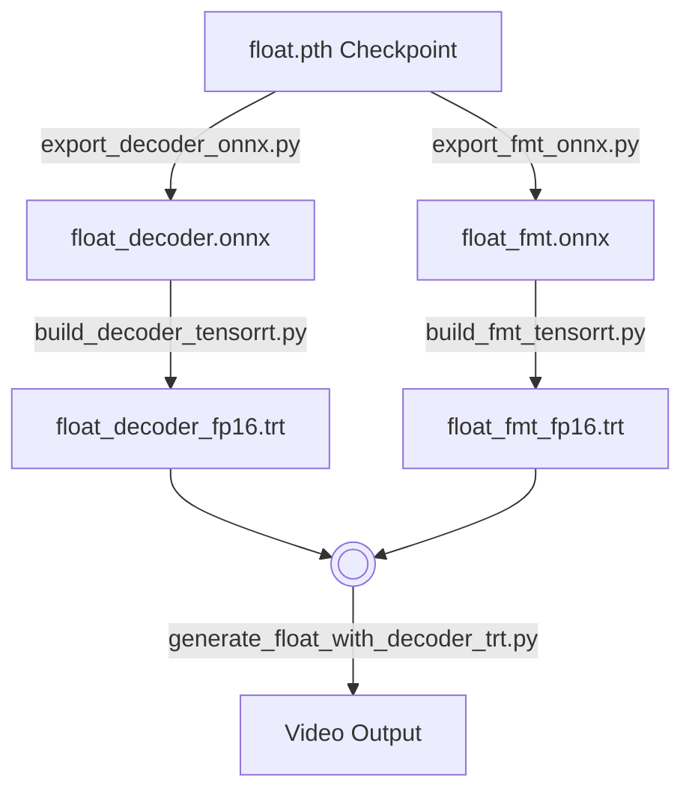

# FLOAT with NVIDIA TensorRT

This guide provides instructions for exporting, compiling, and running the **FLOAT** talking-head model inference pipeline using **NVIDIA TensorRT** and **ONNX**.

---

## Prerequisites & Setup

### 0. FLOAT's installation
Please follow the installation guide on the [FLOAT](https://github.com/deepbrainai-research/float/) repository.

### 1. Environment Setup
Install the required packages for ONNX export and TensorRT compilation:

```bash
pip install -r ./accelerate_dev/requirements_tensorrt.txt
```

---

### Tested System Configuration
The scripts have been verified on the following hardware and software stack:
* **GPU:** NVIDIA GeForce RTX 3090 (24GB)
* **Driver Version:** 560.35.03
* **CUDA Version:** 12.6 (NVCC: `Cuda compilation tools, release 12.6, V12.6.68`)
* **Python Version:** 3.9.25

---

## Core Steps Overview

The acceleration workflow consists of three main steps:
1. **Export Pytorch (.pth) checkpoints to ONNX format**
2. **Build TensorRT engines from the ONNX models**
3. **Execute accelerated inference using the TensorRT engines**



[#] Note: We used fp16 quantization for this overview example.

---

## Step 1: Export Checkpoints to ONNX & Build TensorRT Engines

Throughout this tutorial, we will use ./for_released as the target directory.

### 1. FLOAT's Decoder
Export the decoder PyTorch checkpoint to ONNX, then build the TensorRT engine:
```bash
python ./accelerate_dev/export_decoder_onnx.py \
  --output_dir ./for_released/decoder/ \
  --model_name float_decoder.onnx \
  --ckpt_path ./checkpoints/float.pth

python ./accelerate_dev/build_decoder_tensorrt.py \
  --input_onnx_path ./for_released/decoder/float_decoder.onnx \
  --output_engine_path ./for_released/decoder/ \
  --precision fp16
```

### 2. FLOAT's FMT (Flow Matching Transformer)
Export the FMT PyTorch checkpoint to ONNX, then build the TensorRT engine:
```bash
python ./accelerate_dev/export_fmt_onnx.py \
  --output_dir ./for_released/fmt/ \
  --model_name float_fmt.onnx \
  --ckpt_path ./checkpoints/float.pth

python ./accelerate_dev/build_fmt_tensorrt.py \
  --input_onnx_path ./for_released/fmt/float_fmt.onnx \
  --output_engine_path ./for_released/fmt/ \
  --precision fp16
```

> [!NOTE]
> Converting the distilled student model (`fmt_student`) to TensorRT is currently **not supported**, as its native PyTorch speed is already fast enough for real-time applications.

### Command Line Arguments

#### 1. ONNX Export Scripts (`export_decoder_onnx.py` & `export_fmt_onnx.py`)

| Argument | Description | Default |
| :--- | :--- | :--- |
| `--ckpt_path` | Path to the PyTorch checkpoint file (`.pth` or `.pt`). | `./checkpoints/float.pth` |
| `--output_dir` | Directory to save the exported ONNX model. | `onnx_models` / `accelerate_dev` |
| `--model_name` | Name of the exported ONNX model file. | `float_decoder.onnx` / `float_fmt.onnx` |
| `--opset` | ONNX operator set version (Opset 17 is recommended). | `17` |
| `--batch-size` | Batch size for dummy inputs during tracing. Keep fixed to 1. | `1` |
| `--verbose` | Enable verbose logging during export. | `False` |

#### 2. TensorRT Build Scripts (`build_decoder_tensorrt.py` & `build_fmt_tensorrt.py`)

| Argument | Description | Default |
| :--- | :--- | :--- |
| `--input_onnx_path` | Path to the input ONNX model file. | *Required* |
| `--output_engine_path` | Path to save the compiled TensorRT engine file or directory. | *Required* |
| `--precision` | Quantization precision mode. Choices: `fp32`, `fp16`, `tf32`, `fp8`. | `fp32` |

### Directory Layout
After finished the first step, your `./for_released` directory will have the following structure:
```text
./for_released
├── decoder
│   ├── float_decoder_fp16.trt
│   └── float_decoder.onnx
└── fmt
    ├── float_fmt_fp16.trt
    └── float_fmt.onnx
```

---

## Step 2: Running Generation Scripts

All scripts share the same options (`--a_cfg`, `--e_cfg`, `--emo`) similar to the standard `float` and `SCB-AI_talking_head_distillation` repositories. Follow these options to change the emotion type, emotion strength, guidance scales, etc.

### 1. FLOAT: `Default`
Runs the default PyTorch model. (This script is similar to generate.py but includes runtime profiling.):
```bash
python generate_float.py \
  --ref_path assets/Ton.png \
  --aud_path assets/aud-sample-vs-1.wav \
  --ckpt_path checkpoints/float.pth \
  --res_video_path ./for_released/output/default \
  --seed 47 --seed_everything
```

### 2. FLOAT `with` Decoder TensorRT: `TRT(Decoder)`
Runs FMT in PyTorch and accelerates the Decoder utilizing TensorRT:
```bash
python generate_float_with_decoder_trt.py \
  --ref_path ./assets/Ton.png \
  --aud_path assets/aud-sample-vs-1.wav \
  --seed 47 --seed_everything \
  --ckpt_path ./checkpoints/float.pth \
  --res_video_path ./for_released/output/trt_decoder \
  --trt_decoder_path for_released/decoder/float_decoder_fp16.trt
```
*(If `--trt_decoder_path` is not specified, it will fallback to the default PyTorch decoder).*

### 3. FLOAT `with` TensorRT on FMT and Decoder: `TRT (FMT + Decoder)`
Accelerates both the FMT and Decoder networks:
```bash
python generate_float_with_decoder_trt.py \
  --ref_path ./assets/Ton.png \
  --aud_path assets/aud-sample-vs-1.wav \
  --seed 47 --seed_everything \
  --ckpt_path ./checkpoints/float.pth \
  --res_video_path ./for_released/output/trt-fmt_trt-decoder \
  --trt_decoder_path for_released/decoder/float_decoder_fp16.trt \
  --trt_fmt_path ./for_released/fmt/float_fmt_fp16.trt
```
*(If `--trt_decoder_path` is not specified, it will fallback to the default PyTorch decoder; if `--trt_fmt_path` is not specified, it will fallback to the default PyTorch FMT).*

### 4. FLOAT (Student) `without` Decoder TensorRT: `Student FMT`
Runs the entire distilled student model pipeline in PyTorch:
```bash
python generate_student_with_decoder_trt.py \
  --ref_path ./assets/Ton.png \
  --aud_path ./assets/aud-sample-vs-1.wav \
  --ckpt_path ./checkpoints/student_fmt_distill/student_fmt_best_earlystop.pt \
  --res_video_path ./for_released/output/student-fmt/ \
  --seed 47 --seed_everything
```

### 5. FLOAT (Student) `with` Decoder TensorRT: `Student FMT + TRT (Decoder)`
Runs the distilled student FMT model in PyTorch and accelerates the Decoder:
```bash
python generate_student_with_decoder_trt.py \
  --ref_path ./assets/Ton.png \
  --aud_path ./assets/aud-sample-vs-1.wav \
  --ckpt_path ./checkpoints/student_fmt_distill/student_fmt_best_earlystop.pt \
  --trt_decoder_path trt_models/float_decoder_fp16.trt \
  --res_video_path ./for_released/output/student-fmt_trt-decoder/ \
  --seed 47 --seed_everything
```

---

## Result

The output should look like this:

