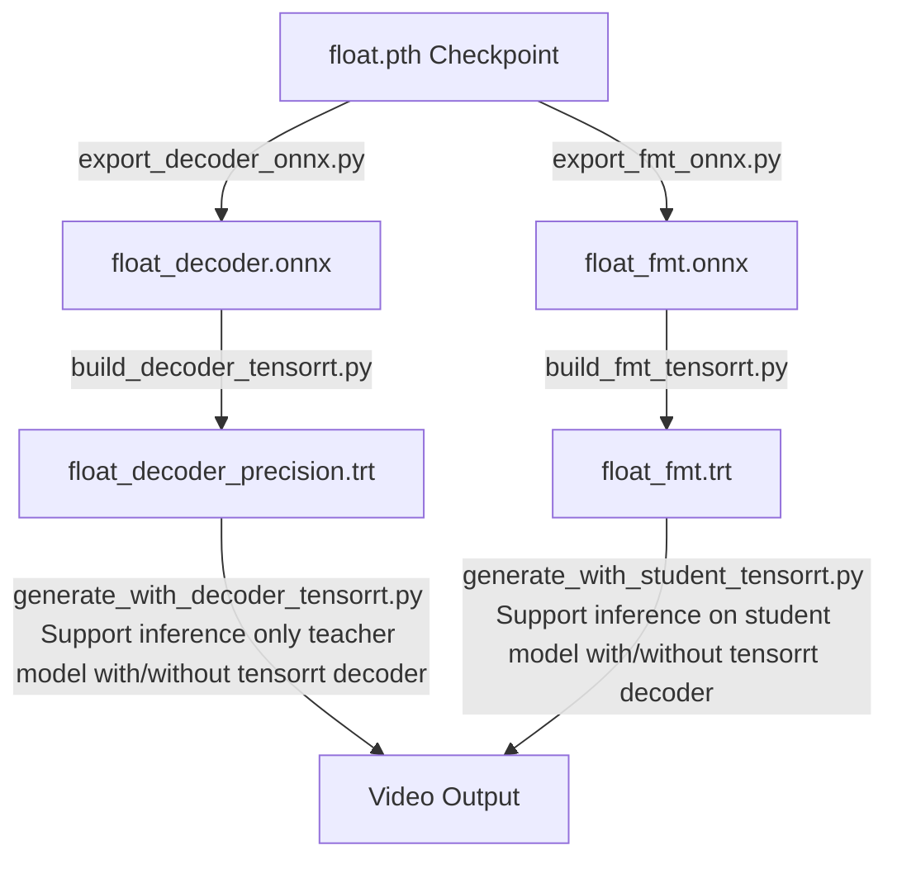

# Acceleration Guide: FLOAT with NVIDIA TensorRT

This guide provides instructions for accelerating the **FLOAT** talking-head model inference pipeline using **NVIDIA TensorRT**. 

By converting the PyTorch checkpoints into optimized TensorRT engines, you can achieve significant speedups for both the **FLOAT's FMT (Flow-Matching Transformer)** and the **FLOAT's Decoder**.

---

## Prerequisites & Setup

### 0. FLOAT's environment Setup
Please finish the install of FLOAT[https://github.com/deepbrainai-research/float]

### 1. Environment Setup
Install the required packages for ONNX export and TensorRT compilation:

```bash
pip install -r ./accelerate_dev/requirements_tensorrt.txt
```

### NOTE: Tested System Configuration
The scripts have been verified on the following hardware and software stack:
* **GPU:** NVIDIA GeForce RTX 3090 (24GB)
* **Driver Version:** 560.35.03
* **CUDA Version:** 12.6 (NVCC: `Cuda compilation tools, release 12.6, V12.6.68`)
* **Python Version:** 3.9.25

---

## Core Steps Overview

The acceleration workflow consists of three main steps:
1. **Export Pytorch (.pth) checkpoints to ONNX format**
2. **Build TensorRT engines from the ONNX models**
3. **Execute accelerated inference using the TensorRT engines**



---

## Step 1: Export Checkpoints to ONNX

The model is split into two components for export: the **FLOAT's Decoder** and the **FLOAT's FMT**.

### 1. Export the FLOAT's Decoder
```bash
python ./accelerate_dev/export_decoder_onnx.py \
  --ckpt_path <path_to_ckpt> \
  --output_dir <output_dir> \
  --model_name <model_name> \
  --opset 17
```

### 2. Export the FLOAT's FMT (Flow Matching Transformer)
```bash
python ./accelerate_dev/export_fmt_onnx.py \
  --ckpt_path <path_to_ckpt> \
  --output_dir <output_dir> \
  --model_name <model_name> \
  --opset 17
```

Example:
- Convert FLOAT's FMT into ONNX
python ./accelerate_dev/export_fmt_onnx.py --output_dir ./test_released/fmt/ --model_name float_fmt.onnx --ckpt_path ./checkpoints/float.pth

- Convert FLOAT's FMT student into ONNX
python ./accelerate_dev/export_fmt_onnx.py --output_dir ./test_released/fmt/ --model_name float_fmt_student.onnx --ckpt_path ./checkpoints/student_fmt_distill/student_fmt_best_earlystop.pt


### Command Line Arguments for Export Scripts

| Argument | Description | Default |
| :--- | :--- | :--- |
| `--ckpt_path` | Path to the PyTorch checkpoint file (`.pth` or `.pt`). | `./checkpoints/float.pth` |
| `--output_dir` | Directory to save the exported ONNX model. | `onnx_models` (Decoder) |
| `--model_name` | Name of the exported ONNX model file. | `float_decoder.onnx` / `float_fmt.onnx` / `float_fmt_student.onnx` |
| `--opset` | ONNX operator set version (Opset 17 is relatively new and enough for newer operation recommended for newer operations). | `17` |
| `--batch-size` | Batch size for dummy inputs during tracing. Keep fixed to 1. | `1` |
| `--verbose` | Enable verbose logging during export. | `False` |


---

## Step 2: Build TensorRT Engines

Next, compile the ONNX files into optimized `.trt` engine files. You can choose different precision modes depending on your hardware support.

### 1. Build Decoder Engine
```bash
python ./accelerate_dev/build_decoder_tensorrt.py \
  --input_onnx_path ./onnx_models/float_decoder.onnx \
  --output_engine_path ./trt_models/float_decoder.trt \
  --precision fp16
```

#### CLI Arguments:
* `--input_onnx_path`: Path to the input decoder ONNX model.
* `--output_engine_path`: Path to save the compiled TensorRT engine (e.g. `./trt_models/float_decoder.trt`). If a directory is provided, it will automatically name it based on the input name and precision.
* `--precision`: Quantization mode. Options: `fp32`, `fp16`, `tf32`, `fp8`.
* `--min_batch`, `--opt_batch`, `--max_batch`: Limits for the dynamic batch optimization profiles. Default is 1 since generation runs autoregressively on chunk sizes of 1.

### 2. Build FMT Engine
```bash
python ./accelerate_dev/build_fmt_tensorrt.py \
  --onnx_path ./onnx_models/float_fmt.onnx \
  --engine_path ./trt_models/float_fmt.trt \
  --precision fp16
```

#### CLI Arguments:
* `--onnx_path`: Path to the input FMT ONNX model.
* `--engine_path`: Path to save the compiled TensorRT engine.
* `--precision`: Quantization mode. Options: `fp32`, `fp16`, `tf32`, `fp8`.

> [!NOTE]
> For `--precision fp8`, layers not supported by TensorRT for FP8 quantization automatically fallback to FP16.

---

## Step 3: Run Accelerated Inference

Execute the talking-head generation using the compiled TensorRT engines for FMT and the Decoder.

```bash
python generate_with_tensorrt.py \
  --ref_path ./extra_assests/face/Ton.png \
  --aud_path ./assets/aud-sample-vs-1.wav \
  --trt_model_path ./trt_models/float_fmt_fp16.trt \
  --trt_decoder_path ./trt_models/float_decoder_fp16.trt \
  --res_video_path ./results/output_trt_fp16
```

### Key CLI Arguments:
* `--trt_model_path` (Required): Path to the compiled FMT TensorRT engine (`.trt`/`.engine`).
* `--trt_decoder_path` (Optional): Path to the compiled Decoder TensorRT engine. If not provided, decoding will run via the standard PyTorch decoder.
* `--ref_path`: Path to the reference image.
* `--aud_path`: Path to the source audio file.
* `--emo`: Emotion mode. Options: `angry`, `disgust`, `fear`, `happy`, `neutral`, `sad`, `surprise`.
* `--a_cfg_scale` / `--e_cfg_scale`: Audio and expressive emotion classifier-free guidance scales.
* `--seed`: Random seed for FMT sampling.

---

## Benchmarking & Experiments

You can benchmark all 9 precision combinations of FMT and Decoder (`fp32`, `tf32`, `fp16`) for both default and emotional setups using `run_experiments.py`:

```bash
python ./accelerate_dev/run_experiments.py
```

This script will run batch generation across all combinations and output performance metrics (like Sampling Time, Decoding Time, FPS, and Total Time) into:
* JSON format: `./accelerate_dev/experiment_results.json`
* Markdown table format: [experiment_results.md](file:///home/mint/Dev/SCBx-TalkingHead/float/accelerate_dev/experiment_results.md)
