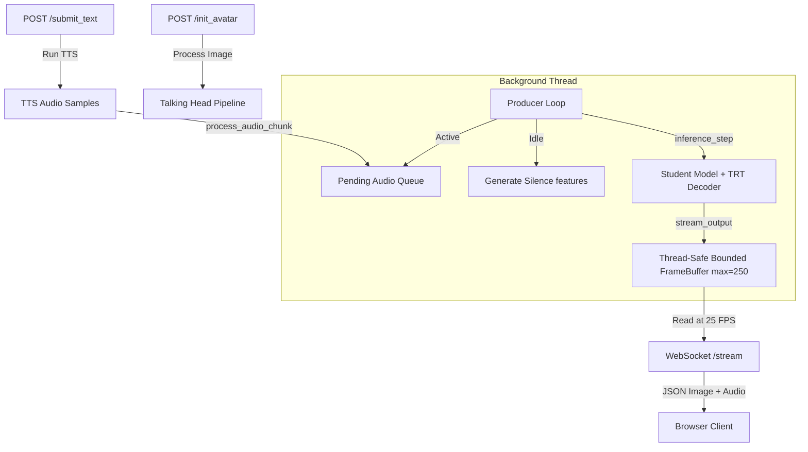

# Real-Time Talking Head Streaming Demo

This directory implements a modular, persistent, real-time talking-head streaming demo using the **Student Model + TensorRT Decoder**. The pipeline is decoupled into a high-performance **GPU producer thread** and a lightweight **async WebSocket consumer**.

## Directory Structure
- [pipeline.py](file:///home/mint/Dev/SCBx-TalkingHead/float/demo/pipeline.py): Contains options, model loader wrapper, and atomic functions (`init_avatar`, `process_audio_chunk`, `inference_step`, `stream_output`).
- [server.py](file:///home/mint/Dev/SCBx-TalkingHead/float/demo/server.py): FastAPI server containing HTTP endpoints (`/init_avatar`, `/submit_text`), WebSocket endpoint (`/stream`), and the background autoregressive loop.
- [templates/index.html](file:///home/mint/Dev/SCBx-TalkingHead/float/demo/templates/index.html): Custom HTML5 Web UI featuring a sleek dark-theme layout, drag-and-drop uploader, emotion controller, and canvas synchronization engine.

---

## Design Decision: FastAPI + WebSockets vs. Gradio

For persistent, low-latency autoregressive talking head streaming, **FastAPI + Uvicorn (WebSockets)** was chosen over Gradio due to the following key architectural requirements:
1. **Precise Frame Rate Control**: WebSockets enable sending frame-by-frame binary data (`(JPEG image, 640 float32 audio samples)`) at exactly 25 FPS (40ms interval). Gradio's streaming generator wraps internal yield-loops that lack frame-by-frame scheduling control and introduce significant protocol overhead.
2. **Audio-Video Synchronization**: Web Audio API requires a steady stream of raw PCM audio samples scheduled sequentially. By packing individual video frames with matching audio slices and streaming them via WebSockets, the browser client can render frames exactly when their corresponding audio plays.
3. **Decoupled Concurrency**: FastAPI runs asynchronously using `asyncio` and easily runs CPU/GPU-intensive code on background executors or daemon threads, avoiding event loop blockage.
4. **Custom Jitter Buffer**: A custom JavaScript-based jitter buffer queue on the frontend absorbs network packet jitter, yielding stutter-free, lipsynced playback.

---

## Concurrency Model



- **Thread-safe Bounded Frame Buffer**: Built on Python's `collections.deque` with a maxsize of 250 frames (10 seconds). If the consumer falls behind (e.g. network lag), older frames are automatically dropped rather than blocking the GPU loop.
- **Throttling**: The producer thread monitors client connections. If no WebSocket client is connected, the GPU loop sleeps to prevent burning system resources, automatically resuming when a socket connects.
- **Connection Safety**: PyCUDA's device context is explicitly bound to the background producer thread upon startup, avoiding multi-threaded driver exceptions.

---

## How to Run

1. **Set up environment variables** (optional, default paths are loaded automatically):
   ```bash
   export CUDA_VISIBLE_DEVICES=1
   ```

2. **Start the FastAPI server**:
   ```bash
   python -m demo.server
   ```

3. **Access the Web UI**:
   Open `http://localhost:8000` in your web browser.
   - Drag and drop a portrait image to initialize the model.
   - Enter text in the TTS field and select an emotion, then click **Synthesize & Speak**.
